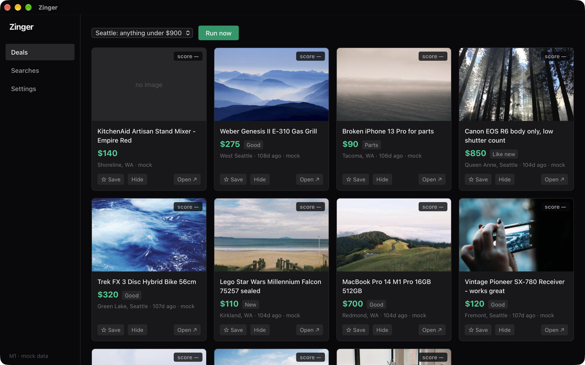

# Zinger



A local-first desktop app that watches saved second-hand searches across
Craigslist, eBay and (opt-in) Facebook Marketplace, folds the cross-posts
together, and keeps the whole thing in a SQLite file on your own machine.
Tauri 2, Rust core, React UI.

No accounts, no backend, no telemetry. API keys go to the OS keychain.

## How it works

Each source implements one adapter trait (`search`, `health`,
`rate_limit_policy`). The poll layer runs every adapter in isolation, so one
broken source shows up as a row in the run report instead of aborting the
cycle, and repeated failures back off exponentially up to 24 h. Cross-posts are
folded together by a perceptual hash of the first photo, with a title/price hash
as the fallback. A background scheduler re-runs each saved search on its own
interval with jitter.

Design decisions, dedup details and the per-marketplace access notes are in
[ARCHITECTURE.md](ARCHITECTURE.md).

## Marketplace access

- **eBay**: official Browse API with your own developer keys, stored in the OS
  keychain.
- **Craigslist**: no API. The adapter parses public search pages politely, but
  using it may still breach Craigslist's terms.
- **Facebook Marketplace**: no API, and automation breaches Facebook's Terms of
  Service. Off by default, behind a one-time acceptance gate, and it can get the
  account you use restricted. See ARCHITECTURE.md before enabling it.

## Running it

Needs Rust 1.80+, Node 20+, and the
[Tauri 2 system dependencies](https://tauri.app/start/prerequisites/).

```sh
npm install
npm run tauri dev      # run it
npm run tauri build    # package for your platform

cd src-tauri && cargo test   # 44 offline tests; 1 live smoke test is #[ignore]d
```

The database goes in the platform app-data directory
(`~/Library/Application Support/com.zinger.app/zinger.db` on macOS). Set
`ZINGER_DATA_DIR` to use a different directory, for example a scratch one in dev.

eBay is optional but is the only source with a supported API: create a free
account at developer.ebay.com, make an app with production keys, then paste the
App ID and Cert ID into Settings and hit Test connection. They go to the
keychain, never the database and never the logs.

The Facebook sidecar has its own `npm install` in `sidecar/` and only matters
if you enable Facebook. Chromium (~341 MB) is downloaded on first enable.

## Status

Working: Craigslist and eBay adapters, opt-in Facebook adapter, per-adapter
backoff, background scheduler, photo-hash dedup, saved searches, the deals feed
with save/hide, and settings. The 44 tests run offline against fixtures captured
from the real sites.

Not built yet:

- **Valuation.** Ranking listings by expected profit against sold comps is the
  goal but does not exist; the feed shows `score —` instead of a made-up number.
- **Notifications.**

The Facebook live search path is experimental: its selectors have not been
checked against a real logged-in page. The Craigslist site slug is guessed from
the location text and can be overridden in Settings for metros like `sfbay`.

## License

MIT. See [LICENSE](LICENSE).
